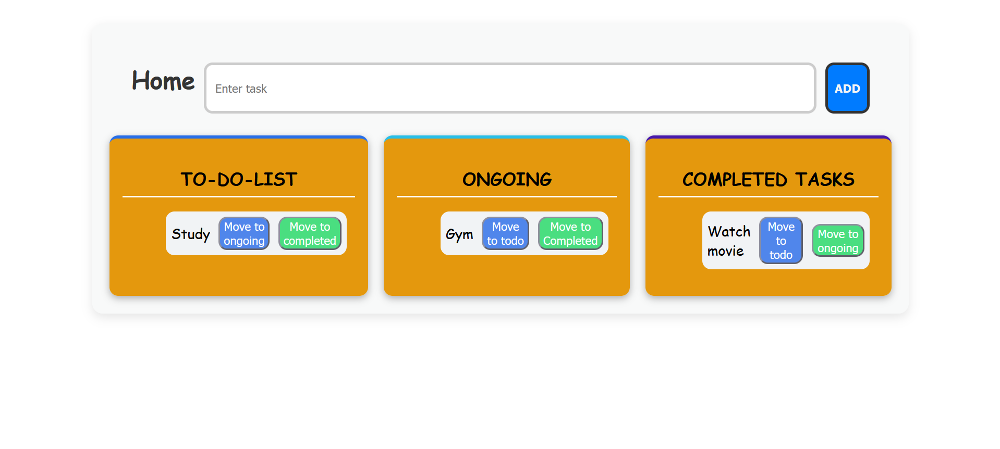

# React + Vite

<!-- This template provides a minimal setup to get React working in Vite with HMR and some ESLint rules.

Currently, two official plugins are available:

- [@vitejs/plugin-react](https://github.com/vitejs/vite-plugin-react/blob/main/packages/plugin-react) uses [Babel](https://babeljs.io/) for Fast Refresh
- [@vitejs/plugin-react-swc](https://github.com/vitejs/vite-plugin-react/blob/main/packages/plugin-react-swc) uses [SWC](https://swc.rs/) for Fast Refresh

## Expanding the ESLint configuration

If you are developing a production application, we recommend using TypeScript with type-aware lint rules enabled. Check out the [TS template](https://github.com/vitejs/vite/tree/main/packages/create-vite/template-react-ts) for information on how to integrate TypeScript and [`typescript-eslint`](https://typescript-eslint.io) in your project. -->
# 📝 Todo Task Manager

A simple **React-based To-Do Task Manager** with features to add, update, and complete tasks.  
Built using **React + Vite**, styled with **CSS**.

---

## 🚀 Features
- Add new tasks  
- Move tasks between **Todo**, **Ongoing**, and **Completed** sections  
- Update or delete tasks  
- Simple and responsive UI  

---

## 📦 Installation
# Clone the repository
git clone https://github.com/your-username/Todo-task-Manager.git

# Navigate to the project folder
cd Todo-task-Manager

# Install dependencies
npm install

# Start the development server
npm run dev

## 📸 Screenshot

